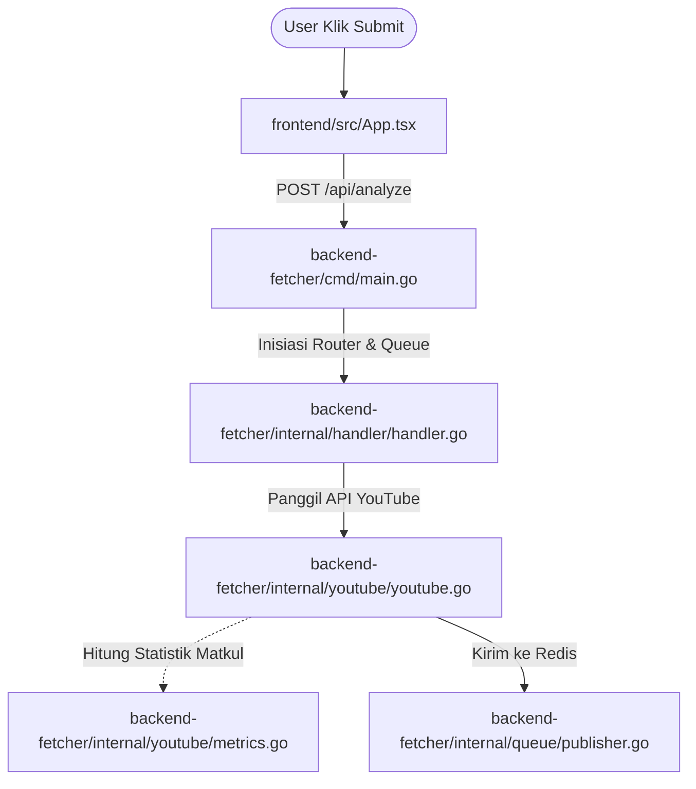
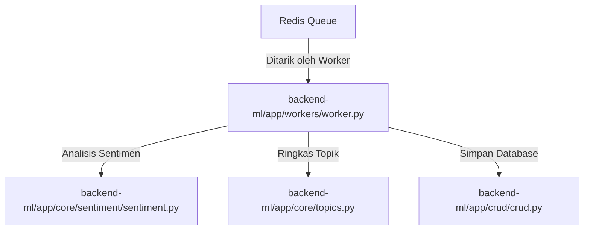
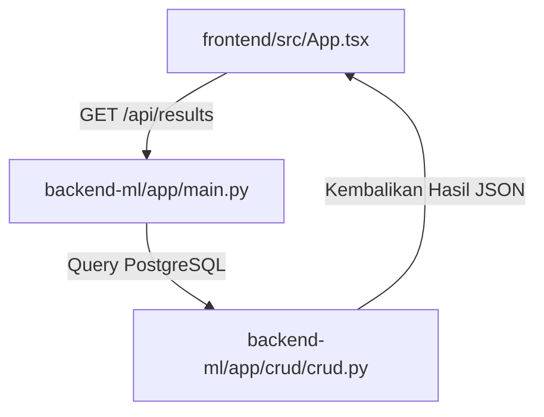
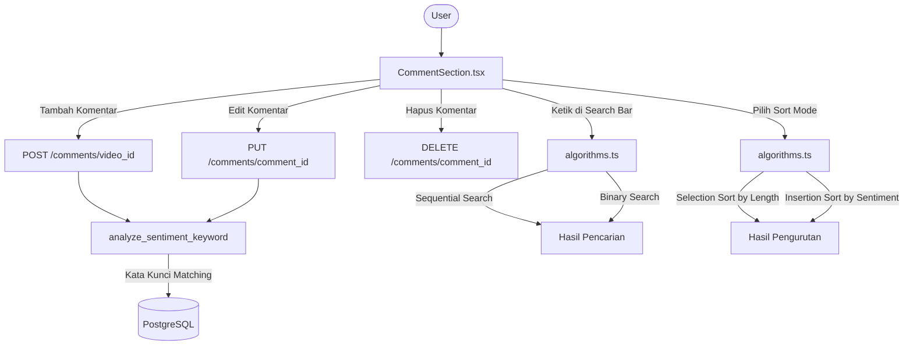

# Alur Eksekusi Sistem (System Execution Flow) NeuroTube

Dokumen ini menjelaskan urutan jalannya proses aplikasi NeuroTube langkah-demi-langkah (End-to-End) beserta file-file kode yang terlibat dan saling berinteraksi.

---

## Ringkasan Peta Alur (Pipeline Map)

NeuroTube memiliki **2 jalur utama** yang berbeda:

### Jalur 1: Analisis Video YouTube (ML Otomatis)

```text
[FRONTEND REACT] ───────────────> [BACKEND GOLANG] ──────────────> [REDIS QUEUE]
Halaman Utama                     1. cmd/main.go                   Antrean Tugas
App.tsx                           2. internal/handler/handler.go   In-Memory
                                  3. internal/youtube/youtube.go
                                  4. internal/youtube/metrics.go
                                         │
                                         ▼
[FRONTEND REACT] <─────────────── [DATABASE PG] <──────────── [BACKEND PYTHON]
Halaman Dashboard                 PostgreSQL DB               1. app/workers/worker.py
App.tsx                                                       2. app/core/sentiment/sentiment.py
                                                              3. app/core/topics.py
                                                              4. app/crud/crud.py
```

### Jalur 2: Komentar Manual (Keyword-Based)

```text
[FRONTEND REACT] ──── POST/PUT/DELETE ────> [BACKEND PYTHON]
CommentSection.tsx                           app/api/routes/analysis.py
 ├── Form Tambah Komentar                    ├── POST /comments/{video_id}
 ├── Tombol Edit                             ├── PUT /comments/{comment_id}
 └── Tombol Hapus                            └── DELETE /comments/{comment_id}
                                                    │
                                              analyze_sentiment_keyword()
                                              (Kata Kunci Positif/Negatif)
```

### Jalur 3: Pencarian & Pengurutan (Frontend Algorithms)

```text
[FRONTEND REACT]
CommentSection.tsx
 ├── Search Bar ──> algorithms.ts ──> sequentialSearch() / binarySearch()
 └── Sort Dropdown ──> algorithms.ts ──> selectionSortByLength() / insertionSortBySentiment()
```

---

## 1. Fase 1: Inisiasi & Pengantrean Data (Golang Fetcher)

Fase ini dimulai dari browser pengguna ketika mengirimkan URL video YouTube yang ingin dianalisis ke server Backend Golang.



* **`frontend/src/App.tsx`**
  * **Peran:** Antarmuka Utama (Single Page Application).
  * **Proses:** Pengguna memasukkan URL YouTube dan menekan tombol analisis. Halaman ini mengirim request HTTP `POST /api/analyze` berisi payload URL tersebut ke backend Golang.
* **`backend-fetcher/cmd/main.go`**
  * **Peran:** Titik Masuk (Entry Point) Golang.
  * **Proses:** Server Golang menerima request. Pertama kali masuk ke fungsi `main()`, program menginisiasi koneksi ke Redis menggunakan `queue.NewPublisher` dan menyalakan router HTTP (Chi Router) untuk mengoper kendali request ke handler.
* **`backend-fetcher/internal/handler/handler.go` (Fungsi `AnalyzeVideo`)**
  * **Peran:** Pengendali HTTP (HTTP Controller).
  * **Proses:**
    * Mengekstrak `videoID` dari URL menggunakan ekspresi reguler (RegEx).
    * Membuat **Job ID** unik secara acak berbasis UUID (`uuid.NewString()`).
    * Menjalankan **Goroutine** (proses asinkron di latar belakang) untuk mengunduh data agar server Golang bisa langsung mengembalikan Job ID ke Frontend tanpa harus membuat user menunggu proses unduhan selesai.
* **`backend-fetcher/internal/youtube/youtube.go` (Fungsi `FetchComments`)**
  * **Peran:** Komunikator YouTube API.
  * **Proses:** Goroutine memanggil file ini untuk melakukan request HTTP secara berulang ke server Google (**YouTube Data API v3**) guna mendownload metadata video dan memanen hingga maksimal 5000 komentar beserta balasan komentarnya.
* **`backend-fetcher/internal/youtube/metrics.go` (Fungsi `logCommentMetrics`)**
  * **Peran:** Algoritma Statistik Akademik (Syarat Tugas Besar).
  * **Proses:** Setelah komentar selesai di-download, data komentar tersebut dilempar ke file ini untuk dihitung statistiknya menggunakan berbagai algoritma dasar komputer (Selection Sort, Insertion Sort, Binary Search, Nilai Ekstrim, Rekursif) lalu mencetak laporannya ke log konsol terminal.
* **`backend-fetcher/internal/queue/publisher.go` (Fungsi `PublishJob`)**
  * **Peran:** Penerbit Pesan Antrean (Queue Publisher).
  * **Proses:** Data komentar yang terkumpul dibungkus menjadi format JSON dan dikirim ke **Redis** Broker. Status pekerjaan pada Redis diubah menjadi `"processing"`.

---

## 2. Fase 2: Analisis AI & Database (Python ML)

Server Python mendeteksi adanya pekerjaan baru di Redis dan langsung mengeksekusi analisis sentimen dan ekstraksi topik di latar belakang (*background*).



* **`backend-ml/app/workers/worker.py` (Fungsi `process_job`)**
  * **Peran:** Background Task Listener (Pekerja Latar Belakang).
  * **Proses:** Berjalan terus-menerus memantau antrean Redis. Begitu ada paket data komentar dari Golang, worker menarik (*consume*) paket tersebut, mengurai JSON-nya, dan memperbarui persentase kemajuan analisis ke Redis secara berkala.
* **`backend-ml/app/core/sentiment/sentiment.py` (Fungsi `analyze_batch_async`)**
  * **Peran:** Mesin Analisis Sentimen (Sentiment Engine).
  * **Proses:**
    * Teks komentar disaring terlebih dahulu lewat **Spam Filter berbasis Regex** untuk membuang teks sampah tanpa beban GPU.
    * Bahasa dideteksi menggunakan `langdetect`.
    * Jika terdeteksi **Bahasa Indonesia (id)**, rute dialihkan ke model spesialis lokal **Indo-RoBERTa** (`w11wo/indonesian-roberta-base-sentiment-classifier`).
    * Jika bahasa lain/asing, dialihkan ke model global **XLM-RoBERTa** (`cardiffnlp/twitter-xlm-roberta-base-sentiment`).
* **`backend-ml/app/core/topics.py` (Fungsi `extract_topics`)**
  * **Peran:** Peringkas Opini (Summarizer Engine).
  * **Proses:** Mengumpulkan semua komentar untuk diringkas dan diekstrak kata kuncinya menggunakan **Google Gemini API** (`gemini-2.5-flash`). Jika API key kosong atau limit habis, program otomatis jatuh ke metode **Local Extractive Summarization** (peringkas berbasis frekuensi kata statistik matematika biasa).
* **`backend-ml/app/crud/crud.py` (Fungsi `create_analysis_result`)**
  * **Peran:** Database Manager (Operasi CRUD).
  * **Proses:** Hasil klasifikasi sentimen, keyword, dan ringkasan dibungkus ke dalam model skema database (`backend-ml/app/models/models.py`), lalu disimpan secara permanen (operasi `INSERT`) ke database **PostgreSQL** melalui SQLModel. Status pekerjaan di Redis diset menjadi `"completed"`.

---

## 3. Fase 3: Pengambilan Hasil Akhir (React Frontend)

Halaman frontend React mengambil data hasil analisis dari database PostgreSQL untuk ditampilkan ke pengguna dalam bentuk dashboard interaktif.



* **`frontend/src/App.tsx`**
  * **Peran:** Halaman Utama & Dashboard (Single Page Application).
  * **Proses:** Selama Fase 1 & 2 berlangsung, halaman ini melakukan polling status analisis ke backend. Setelah mendeteksi status pekerjaan di Redis bernilai `"completed"`, halaman ini menembak API Python `GET /api/results/{job_id}`.
* **`backend-ml/app/main.py` & `backend-ml/app/crud/crud.py` (Fungsi `get_analysis_result`)**
  * **Peran:** API Endpoint & Database Reader.
  * **Proses:** FastAPI Python menerima permintaan, melakukan kueri pembacaan data (operasi `SELECT`) hasil analisis dari database PostgreSQL, lalu mengirimkannya kembali ke Frontend dalam struktur data JSON.
* **Visualisasi Komponen Grafik:**
  * `App.tsx` menerima JSON tersebut dan meredistribusikannya ke komponen grafik visual berikut untuk ditampilkan kepada pengguna:
    * **`frontend/src/components/CommentCharts.tsx`** (Grafik lingkaran pembagian sentimen / Pie Chart).
    * **`frontend/src/components/SentimentTimeline.tsx`** (Grafik garis tren sentimen dari waktu ke waktu).
    * **`frontend/src/components/AiSummary.tsx`** (Ringkasan AI dan awan kata kunci / Keyword Cloud).
    * **`frontend/src/components/CommentSection.tsx`** (Daftar komentar dengan CRUD, search, sort, dan filter sentimen).

---

## 4. Fase 4: Komentar Manual & Algoritma Tugas Besar

Fase ini berjalan secara independen dari analisis YouTube. Pengguna bisa berinteraksi langsung dengan komentar melalui antarmuka web.



* **CRUD Komentar (Requirement A):**
  * **Tambah:** Form input nama + teks → `POST /comments/{video_id}` → sentimen dianalisis otomatis via `analyze_sentiment_keyword()`.
  * **Edit:** Klik ikon pensil → edit teks → `PUT /comments/{comment_id}` → sentimen dihitung ulang.
  * **Hapus:** Klik ikon tong sampah → `DELETE /comments/{comment_id}`.

* **Analisis Sentimen Kata Kunci (Requirement B):**
  * Fungsi `analyze_sentiment_keyword()` di `analysis.py` mencocokkan teks dengan daftar kata kunci positif (bagus, keren, mantap, good, awesome, love, dll) dan negatif (jelek, buruk, parah, bad, terrible, hate, dll).
  * Jika kata positif > negatif → "positive". Jika negatif > positif → "negative". Jika sama → "neutral".

* **Pencarian (Requirement C):**
  * **Sequential Search:** Memeriksa setiap komentar satu per satu secara berurutan (linear).
  * **Binary Search:** Mengurutkan komentar secara abjad terlebih dahulu, lalu membelah data menjadi dua bagian berulang kali untuk menemukan kecocokan.

* **Pengurutan (Requirement D):**
  * **Selection Sort:** Mengurutkan berdasarkan panjang teks komentar (terpanjang/terpendek).
  * **Insertion Sort:** Mengurutkan berdasarkan tingkat sentimen (Positif → Netral → Negatif).

* **Statistik Sentimen (Requirement E):**
  * Filter buttons di `CommentSection.tsx` menampilkan hitungan jumlah komentar per sentimen: All (total), Positive, Neutral, Negative.
  * Grafik Pie Chart di `CommentCharts.tsx` dan angka ringkasan di `StatBlock.tsx`.
