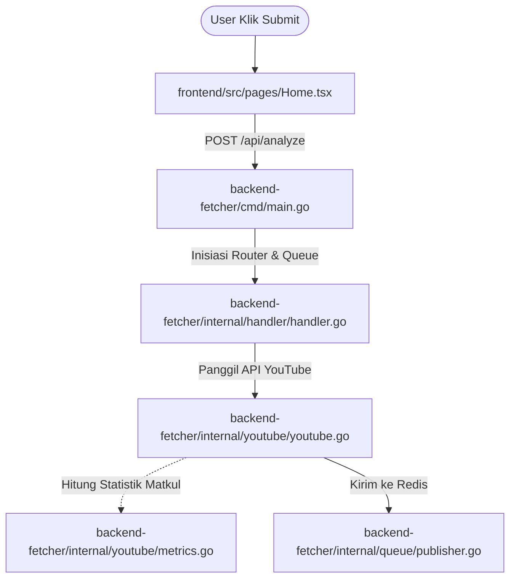
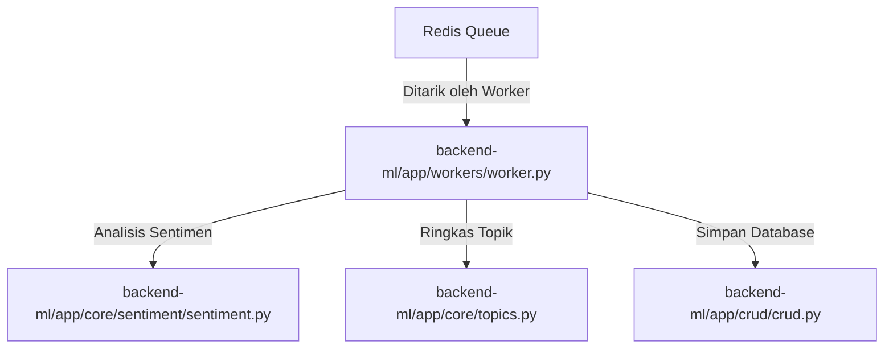
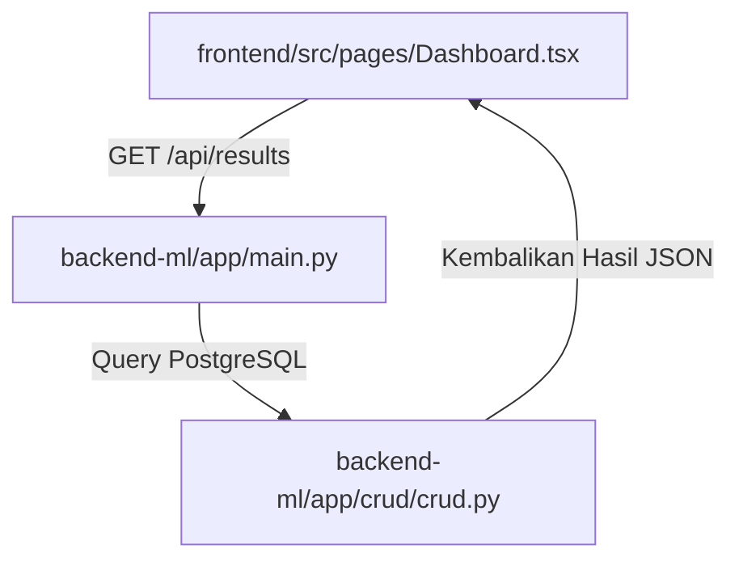

# Alur Eksekusi Sistem (System Execution Flow) NeuroTube

Dokumen ini menjelaskan urutan jalannya proses aplikasi NeuroTube langkah-demi-langkah (End-to-End) beserta file-file kode yang terlibat dan saling berinteraksi.

---

## Ringkasan Peta Alur (Pipeline Map)

Proses dibagi menjadi 3 fase utama yang berjalan secara teratur:


```text
[FRONTEND REACT] ───────────────> [BACKEND GOLANG] ──────────────> [REDIS QUEUE]
Halaman Utama                     1. cmd/main.go                   Antrean Tugas
Home.tsx                          2. internal/handler/handler.go   In-Memory
                                  3. internal/youtube/youtube.go
                                  4. internal/youtube/metrics.go
                                         │
                                         ▼
[FRONTEND REACT] <─────────────── [DATABASE PG] <──────────── [BACKEND PYTHON]
Halaman Dashboard                 PostgreSQL DB               1. app/workers/worker.py
Dashboard.tsx                                                 2. app/core/sentiment/sentiment.py
                                                              3. app/core/topics.py
                                                              4. app/crud/crud.py
```

---

## 1. Fase 1: Inisiasi & Pengantrean Data (Golang Fetcher)

Fase ini dimulai dari browser pengguna ketika mengirimkan URL video YouTube yang ingin dianalisis ke server Backend Golang.



* **`frontend/src/pages/Home.tsx`**
  * **Peran:** Antarmuka Awal.
  * **Proses:** Pengguna memasukkan URL YouTube di halaman utama dan menekan tombol analisis. Halaman ini mengirim request HTTP `POST /api/analyze` berisi payload URL tersebut ke backend Golang.
* **`backend-fetcher/cmd/main.go`**
  * **Peran:** Titik Masuk (Entry Point) Golang.
  * **Proses:** Server Golang menerima request. Pertama kali masuk ke fungsi `main()`, program menginisiasi koneksi ke Redis menggunakan `queue.NewPublisher` dan menyalakan router HTTP (Chi Router) untuk mengoper kendali request ke handler.
* **`backend-fetcher/internal/handler/handler.go` (Fungsi `AnalyzeVideo`)**
  * **Peran:** Pengendali HTTP (HTTP Controller).
  * **Proses:**
    * Mengekstrak `videoID` dari URL menggunakan ekspresi reguler (RegEx).
    * Membuat **Job ID** unik secara acak berbasis UUID (`uuid.NewString()`).
    * Menjalankan **Goroutine** (proses asinkron di latar belakang) untuk mengunduh data agar server Golang bisa langsung mengembalikan Job ID ke Frontend tanpa harus membuat user menunggu proses unduhan selesai.
* **`backend-fetcher/internal/youtube/youtube.go` (Fungsi `FetchComments`)**
  * **Peran:** Komunikator YouTube API.
  * **Proses:** Goroutine memanggil file ini untuk melakukan request HTTP secara berulang ke server Google (**YouTube Data API v3**) guna mendownload metadata video dan memanen hingga maksimal 5000 komentar beserta balasan komentarnya.
* **`backend-fetcher/internal/youtube/metrics.go` (Fungsi `logCommentMetrics`)**
  * **Peran:** Algoritma Statistik Akademik (Syarat Tugas Besar).
  * **Proses:** Setelah komentar selesai di-download, data komentar tersebut dilempar ke file ini untuk dihitung statistiknya menggunakan berbagai algoritma dasar komputer (Selection Sort, Insertion Sort, Binary Search, Nilai Ekstrim, Rekursif) lalu mencetak laporannya ke log konsol terminal.
* **`backend-fetcher/internal/queue/publisher.go` (Fungsi `PublishJob`)**
  * **Peran:** Penerbit Pesan Antrean (Queue Publisher).
  * **Proses:** Data komentar yang terkumpul dibungkus menjadi format JSON dan dikirim ke **Redis** Broker. Status pekerjaan pada Redis diubah menjadi `"processing"`.

---

## 2. Fase 2: Analisis AI & Database (Python ML)

Server Python mendeteksi adanya pekerjaan baru di Redis dan langsung mengeksekusi analisis sentimen dan ekstraksi topik di latar belakang (*background*).



* **`backend-ml/app/workers/worker.py` (Fungsi `process_job`)**
  * **Peran:** Background Task Listener (Pekerja Latar Belakang).
  * **Proses:** Berjalan terus-menerus memantau antrean Redis. Begitu ada paket data komentar dari Golang, worker menarik (*consume*) paket tersebut, mengurai JSON-nya, dan memperbarui persentase kemajuan analisis ke Redis secara berkala.
* **`backend-ml/app/core/sentiment/sentiment.py` (Fungsi `analyze_batch_async`)**
  * **Peran:** Mesin Analisis Sentimen (Sentiment Engine).
  * **Proses:**
    * Teks komentar disaring terlebih dahulu lewat **Spam Filter berbasis Regex** untuk membuang teks sampah tanpa beban GPU.
    * Bahasa dideteksi menggunakan `langdetect`.
    * Jika terdeteksi **Bahasa Indonesia (id)**, rute dialihkan ke model spesialis lokal **Indo-RoBERTa** (`w11wo/indonesian-roberta-base-sentiment-classifier`).
    * Jika bahasa lain/asing, dialihkan ke model global **XLM-RoBERTa** (`cardiffnlp/twitter-xlm-roberta-base-sentiment`).
* **`backend-ml/app/core/topics.py` (Fungsi `extract_topics`)**
  * **Peran:** Peringkas Opini (Summarizer Engine).
  * **Proses:** Mengumpulkan semua komentar untuk diringkas dan diekstrak kata kuncinya menggunakan **Google Gemini API** (`gemini-2.5-flash`). Jika API key kosong atau limit habis, program otomatis jatuh ke metode **Local Extractive Summarization** (peringkas berbasis frekuensi kata statistik matematika biasa).
* **`backend-ml/app/crud/crud.py` (Fungsi `create_analysis_result`)**
  * **Peran:** Database Manager (Operasi CRUD).
  * **Proses:** Hasil klasifikasi sentimen, keyword, dan ringkasan dibungkus ke dalam model skema database (`backend-ml/app/models/models.py`), lalu disimpan secara permanen (operasi `INSERT`) ke database **PostgreSQL** melalui SQLModel. Status pekerjaan di Redis diset menjadi `"completed"`.

---

## 3. Fase 3: Pengambilan Hasil Akhir (React Frontend)

Halaman frontend React mengambil data hasil analisis dari database PostgreSQL untuk ditampilkan ke pengguna dalam bentuk dashboard interaktif.



* **`frontend/src/pages/Dashboard.tsx`**
  * **Peran:** Halaman Laporan Utama (Dashboard View).
  * **Proses:** Selama Fase 1 & 2 berlangsung, halaman ini melakukan polling status analisis ke backend. Setelah mendeteksi status pekerjaan di Redis bernilai `"completed"`, halaman ini menembak API Python `GET /api/results/{job_id}`.
* **`backend-ml/app/main.py` & `backend-ml/app/crud/crud.py` (Fungsi `get_analysis_result`)**
  * **Peran:** API Endpoint & Database Reader.
  * **Proses:** FastAPI Python menerima permintaan, melakukan kueri pembacaan data (operasi `SELECT`) hasil analisis dari database PostgreSQL, lalu mengirimkannya kembali ke Frontend dalam struktur data JSON.
* **Visualisasi Komponen Grafik:**
  * `Dashboard.tsx` menerima JSON tersebut dan meredistribusikannya ke komponen grafik visual berikut untuk ditampilkan kepada pengguna:
    * **`frontend/src/components/SentimentDistribution.tsx`** (Grafik lingkaran pembagian sentimen).
    * **`frontend/src/components/SentimentTimeline.tsx`** (Grafik garis tren sentimen dari waktu ke waktu).
    * **`frontend/src/components/KeywordCloud.tsx`** (Visualisasi awan kata kunci populer).
    * **`frontend/src/components/CommentList.tsx`** (Daftar tabel pencarian komentar beserta filter sentimennya).
