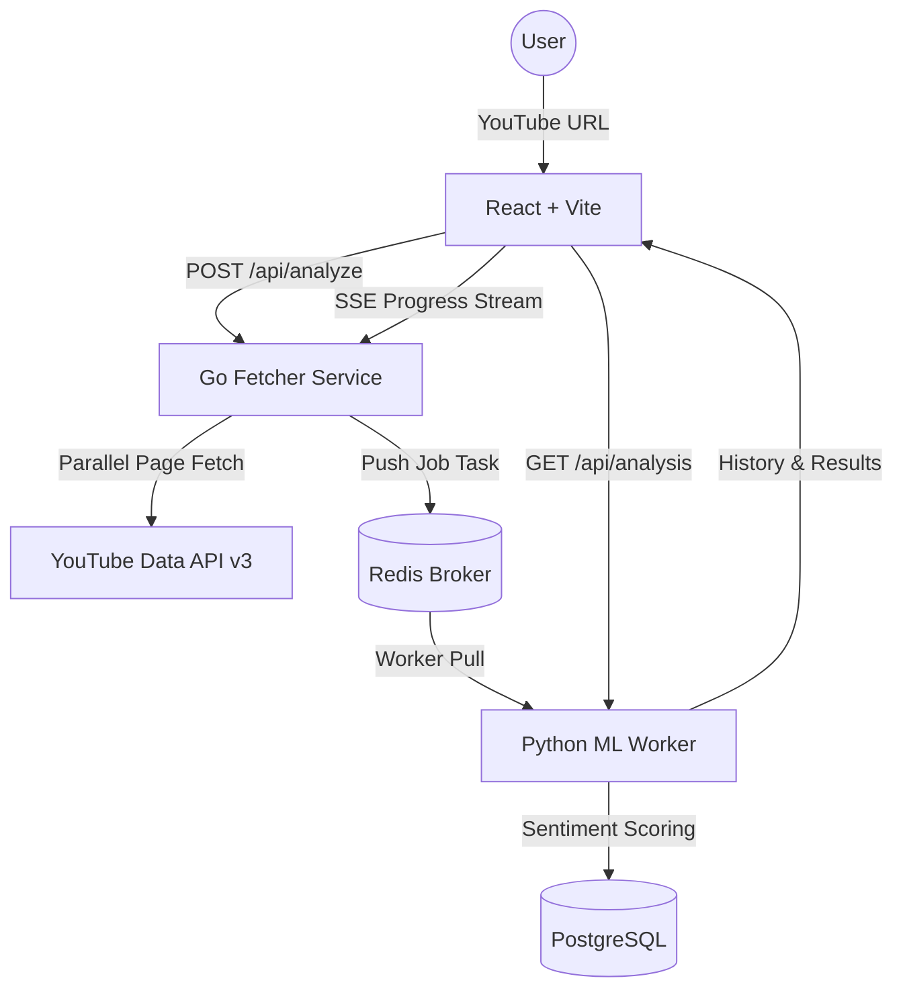

<div align="center">

# NeuroTube: YouTube Comment Sentiment Analyzer


**A full-stack application to analyze YouTube comment sentiments at scale.**

[](https://github.com/DaffMe/NeuroTube)
[](https://github.com/DaffMe/NeuroTube)

</div>

---

> [!NOTE]
> **Developer's Note:** This is my **first-ever project**! Built from scratch with the assistance of **Google Antigravity AI Agent** and **Claude Code (Anthropic)** as my coding companions. As a beginner, the code and architecture may not be 100% perfect — but it's a huge milestone in my learning journey. Feedback and contributions are always welcome!

---

## 🌟 Overview

NeuroTube is a web application that takes a YouTube video URL and analyzes the sentiments of its comments. It fetches comments directly from YouTube, processes them using Hugging Face Transformer models to determine their sentiment (Positive, Neutral, Negative), and visualizes the results on an interactive dashboard.

The project uses a microservices architecture to separate the fast data ingestion from the heavier machine learning tasks.

---

## ✨ Features

- **Concurrent Data Fetching**: Uses a Go backend with semaphore-controlled concurrency to rapidly fetch thousands of YouTube comments and their replies without hitting rate limits.
- **Dual-Engine Sentiment Analysis**: A Python FastAPI backend that routes comments to specialized models — Indonesian RoBERTa for Indonesian text and XLM-RoBERTa for other languages — providing highly accurate, multilingual sentiment classification.
- **AI-Powered Topic Extraction**: Automatically identifies trending topics within positive and negative comment clusters using Gemini AI.
- **Real-Time Progress Streaming**: Server-Sent Events (SSE) provide live progress updates during the analysis pipeline.
- **Quotas-Aware Caching**: Redis-backed intelligent caching prevents redundant API calls within a 24-hour window.
- **Interactive Dashboard**: A modern, responsive frontend built with React 19 and Tailwind CSS v4, featuring:
  - **Sentiment Timeline**: A chart showing how sentiments change over time.
  - **Topic Summaries**: AI-generated summaries of common themes in positive and negative comments.
  - **Deep-Thread Comments Filtering**: Filter through thousands of comments by sentiment or date range.
- **Containerized**: Fully Dockerized setup for easy local deployment.

---

## 🏗️ Architecture

The app is split into three main services:



| Service | Technology | Purpose |
|---------|------------|---------|
| **Frontend** | React 19, TypeScript, Tailwind CSS v4 | User interface and data visualization |
| **Fetcher** | Go (Gin router) | YouTube API integration, job queuing, SSE progress |
| **ML Worker** | Python 3.11, FastAPI, SQLModel | Sentiment analysis, topic extraction, data persistence |

---

## 🚀 Tech Stack

- **Frontend**: React 19, TypeScript, Tailwind CSS v4, Framer Motion, Recharts, Lucide Icons
- **Backend Fetcher**: Go 1.21+, Chi router, Redis (go-redis/v9)
- **Backend ML**: Python 3.11, FastAPI, SQLModel, PostgreSQL, HuggingFace Transformers, PyTorch, Langdetect
- **Infrastructure**: Docker & Docker Compose, NVIDIA GPU support (optional)

---

## 🖥️ UI Showcase

### Landing Page


### Dashboard


---

## 🚀 Quick Start (Docker)

To run this project locally, you need Docker installed, a YouTube Data API Key, and optionally a Gemini API Key.

1. **Clone the repository**
   ```bash
   git clone https://github.com/DaffMe/NeuroTube.git
   cd NeuroTube
   ```

2. **Configure Environment Variables**
   ```bash
   cp .env.example .env
   ```
   Open the `.env` file and fill in:
   - `YOUTUBE_API_KEY` — Get from [Google Cloud Console](https://console.cloud.google.com/)
   - `GEMINI_API_KEY` — Get from [Google AI Studio](https://makersuite.google.com/app/apikey) (optional, for AI topic summaries)

3. **Run with Docker Compose**
   ```bash
   docker compose up --build -d
   ```

4. **Access the Application**
   - **Frontend UI**: `http://localhost:5173`
   - **Python API Docs**: `http://localhost:8000/docs`
   - **Go API Docs**: `http://localhost:8080` (health check)

---

## 🛠️ Local Development (Without Docker)

If you prefer to run the services directly on your host machine:

### 🐍 ML Backend (Python)
```bash
cd backend-ml
python -m venv venv
# On Windows:
venv\Scripts\activate
# On macOS/Linux:
# source venv/bin/activate

pip install -r requirements.txt
uvicorn app.main:app --reload --port 8000
```

### 🐹 Fetcher Backend (Go)
```bash
cd backend-fetcher
go mod download
go run cmd/main.go
```

### 🎨 Frontend (React)
```bash
cd frontend
npm install
npm run dev
```

---

## 🔧 Environment Variables

| Variable | Required | Description |
|----------|----------|-------------|
| `YOUTUBE_API_KEY` | Yes | YouTube Data API v3 key from Google Cloud Console |
| `GEMINI_API_KEY` | No | Gemini API key for AI topic summaries. Without this, topic extraction uses local keyword analysis. |
| `POSTGRES_USER` | No | PostgreSQL username (default: `neurotube`) |
| `POSTGRES_PASSWORD` | No | PostgreSQL password (default: `neurotube_secret`) |
| `POSTGRES_DB` | No | PostgreSQL database name (default: `neurotube`) |
| `FETCHER_PORT` | No | Go fetcher port (default: `8080`) |
| `ML_PORT` | No | Python ML backend port (default: `8000`) |
| `FRONTEND_PORT` | No | Frontend dev server port (default: `5173`) |

---

## 📝 Acknowledgments

- Built with assistance from AI development tools.
- Inspired by [youtube-comment-sentiment-analyzer](https://github.com/00200200/youtube-comment-sentiment-analyzer).
- Sentiment analysis powered by [cardiffnlp/twitter-xlm-roberta-base-sentiment](https://huggingface.co/cardiffnlp/twitter-xlm-roberta-base-sentiment) and [w11wo/indonesian-roberta-base-sentiment-classifier](https://huggingface.co/w11wo/indonesian-roberta-base-sentiment-classifier).

---

<div align="center">
  <b>Developed by <a href="https://github.com/DaffMe">DaffMe</a></b>
</div>
