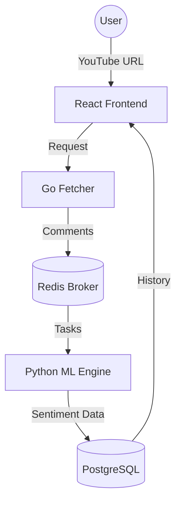

# 🧠 NeuroTube

[](https://opensource.org/licenses/MIT)
[]()
[]()
[]()

> **NeuroTube** is a high-performance, AI-powered sentiment analysis platform for YouTube. It processes thousands of comments in seconds using a distributed microservices architecture to give you deep insights into audience sentiment.

---

## ✨ Features

- 🚀 **Lightning Fast**: Fetch and analyze thousands of comments in seconds.
- 📊 **Deep Insights**: Breakdown of positive, neutral, and negative sentiments with interactive charts.
- 💬 **Full Thread Support**: Analyze not just top-level comments, but all nested replies.
- 🧠 **Smart NLP Engine**: Custom-tuned sentiment analysis optimized for YouTube slang and artistic content.
- 🕒 **History Management**: Track and manage your recent analyses with persistent server-side storage.
- 🎨 **Premium UI**: Modern, responsive dashboard built with Tailwind CSS v4 and Framer Motion.

---

## 🏗️ Architecture

NeuroTube is built as a distributed system to handle high concurrency and large data volumes:



---

## 🛠️ Tech Stack

### Frontend
- **React 19** & **TypeScript**
- **Vite** (Build Tool)
- **Tailwind CSS v4** (Styling)
- **Framer Motion** (Animations)
- **Recharts** (Data Visualization)
- **Bun** (Package Manager)

### Backend Services
- **Go (Golang)**: High-speed YouTube data retrieval.
- **Python (FastAPI)**: Machine Learning engine for sentiment scoring.
- **VADER Sentiment**: Enhanced with custom lexicons for better accuracy.

### Infrastructure
- **Redis**: Message broker for asynchronous task processing.
- **PostgreSQL**: Persistent storage for analysis results and history.
- **Docker & Docker Compose**: Seamless orchestration and deployment.

---

## 🚀 Getting Started

### Prerequisites
- [Docker](https://www.docker.com/) & [Docker Compose](https://docs.docker.com/compose/)
- YouTube Data API Key ([Get it here](https://console.cloud.google.com/))

### Installation

1. **Clone the repository**
   ```bash
   git clone https://github.com/DaffMe/NeuroTube.git
   cd NeuroTube
   ```

2. **Configure Environment Variables**
   Create a `.env` file in the root directory:
   ```bash
   cp .env.example .env
   ```
   Edit `.env` and add your `YOUTUBE_API_KEY`.

3. **Start the application**
   ```bash
   docker compose up --build -d
   ```

4. **Access the Dashboard**
   - Frontend: `http://localhost:5173`
   - Fetcher API: `http://localhost:8080`
   - ML Engine API: `http://localhost:8000`

---

## 📖 API Documentation

### Fetcher (Go)
- `POST /api/analyze`: Trigger analysis for a YouTube URL.

### ML Engine (Python)
- `GET /api/history`: Retrieve analysis history.
- `DELETE /api/history`: Clear all analysis history.
- `GET /api/job/{job_id}`: Check status of an analysis job.

---

## 🤝 Contributing

Contributions are welcome! Please feel free to submit a Pull Request.

---

## 📜 License

This project is licensed under the MIT License - see the [LICENSE](LICENSE) file for details.

---

<p align="center">Made with ❤️ for the YouTube Community</p>
