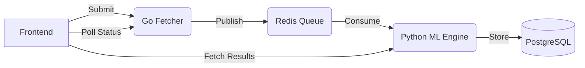

<div align="center">

# 🧠 NeuroTube
### Deciphering the Voice of Millions

[](https://opensource.org/licenses/MIT)
[](https://golang.org/)
[](https://www.python.org/)
[](https://reactjs.org/)
[](https://www.docker.com/)

**NeuroTube** is a high-performance, distributed sentiment analysis engine designed to decode the collective "vibe" of any YouTube video. By harvesting thousands of comments and processing them through a fine-tuned Machine Learning engine, NeuroTube provides instant, actionable insights into audience perception.

[🚀 Explore Features](#-features) • [🛠️ Tech Stack](#️-tech-stack) • [🏁 Quick Start](#-quick-start) • [📊 Architecture](#-architecture)

---


</div>

## ✨ Features

- **⚡ High-Velocity Harvesting**: Built with Go, utilizing high-concurrency goroutines to fetch up to 10,000 comments in seconds.
- **🧵 Deep Thread Analysis**: Full retrieval of nested replies. Unlike standard tools, NeuroTube follows every thread to ensure no voice is left unheard.
- **🤖 Context-Aware ML**: Fine-tuned VADER engine that understands YouTube culture, gaming slang, and emotional nuances (e.g., distinguishing "crying from joy" from actual sadness).
- **🎨 Premium Aesthetic**: A bouncy, "Neuro-sama" inspired pink theme built with Framer Motion and Tailwind CSS.
- **📜 Analysis History**: Persistent storage of past analyses, allowing you to track sentiment trends over time.
- **📈 Visual Insights**: Beautiful, interactive charts (Recharts) for sentiment distribution and statistical breakdown.

## 🛠️ Tech Stack

### Frontend
- **React 18** & **TypeScript**
- **Vite** (Lightning fast build tool)
- **Tailwind CSS v4** & **Shadcn UI**
- **Framer Motion** (Premium animations)
- **Recharts** (Interactive data visualization)

### Backend Services
- **Go (Fetcher)**: High-concurrency harvesting service using the YouTube Data API v3.
- **Python (ML Engine)**: FastAPI-based sentiment processor using VADER and custom linguistic rules.
- **Redis**: High-speed message broker for job queuing and real-time status updates.
- **PostgreSQL**: Robust persistence for video metadata and sentiment results.

## 🏁 Quick Start

### 1. Prerequisites
- [Docker Desktop](https://www.docker.com/products/docker-desktop/)
- [YouTube Data API Key](https://console.cloud.google.com/)

### 2. Configuration
Create a `.env` file in the root directory (refer to [.env.example](file:///c:/Users/daffa/Documents/Code%20Project/Neurotube/.env.example)):
```env
YOUTUBE_API_KEY=your_key_here
```

### 3. Deployment
```bash
docker compose up -d --build
```

### 4. Access
- **Frontend**: `http://localhost:5173`
- **Health Check (Fetcher)**: `http://localhost:8080/api/health`
- **Health Check (ML)**: `http://localhost:8000/api/health`

## 🏗️ Architecture

NeuroTube uses an **event-driven microservices architecture** to ensure scalability and responsiveness:

1. **User** submits a URL via the React Frontend.
2. **Go Fetcher** validates the URL, harvests metadata/comments, and pushes a job to **Redis**.
3. **Python Worker** consumes the job, runs ML analysis, and stores results in **PostgreSQL**.
4. **Frontend** polls status and displays the final results once completed.



## 📜 License
This project is licensed under the MIT License - see the [LICENSE](LICENSE) file for details.

---

<div align="center">
  Built with ❤️ by [Your Name/Github]
</div>
