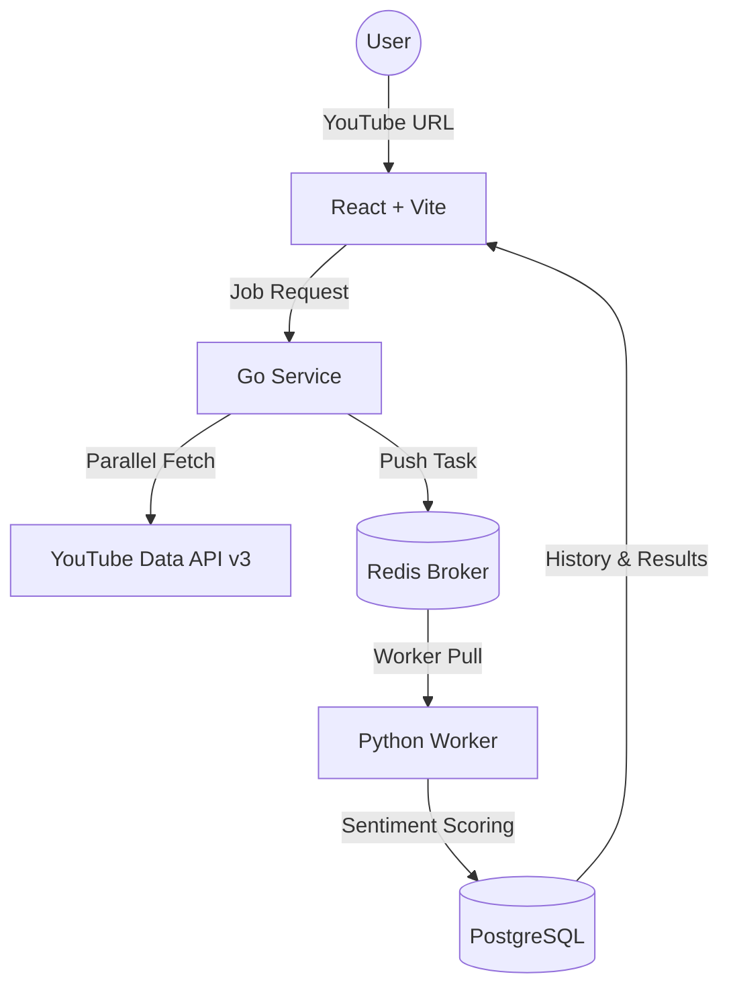

# 🧠 NeuroTube × Google Antigravity

<div align="center">


**Distributed microservices architecture for massive-scale YouTube comment analysis**
*Powered by Google Antigravity AI*

[](https://go.dev/)
[](https://fastapi.tiangolo.com/)
[](https://reactjs.org/)
[](https://redis.io/)
[](https://www.postgresql.org/)
[](https://www.docker.com/)

</div>

---

## 🌟 Overview

**NeuroTube** is a professional-grade sentiment analysis platform designed to handle the high volume of engagement on modern YouTube videos. This project was developed using **Google Antigravity**, an advanced agentic AI coding assistant, to achieve high-performance architecture and polished user experience.

The system design and core functionality were inspired by the excellent work of [00200200's youtube-comment-sentiment-analyzer](https://github.com/00200200/youtube-comment-sentiment-analyzer).

### ✨ Key Features

- **🚀 Hybrid Microservices** - Combines the speed of **Go** for data fetching with the ML power of **Python**.
- **💬 Full Reply Retrieval** - Deep-dive analysis that captures every single nested reply, bypassing standard API limits.
- **🧠 Custom NLP Lexicon** - Sentiment engine specifically tuned for YouTube slang, emojis, and artistic/musical appreciation.
- **📊 Real-time Dashboard** - Interactive visualizations of sentiment distribution and engagement trends.
- **🕒 Persistent History** - Robust server-side storage using PostgreSQL to track and manage your analysis history.
- **🐳 One-Command Deployment** - Fully containerized with Docker Compose for a seamless setup experience.

---

## 🏗️ Architecture

The project is architected for scalability and separation of concerns:



---

## 🖥️ Project Structure

```
NeuroTube/
├── 🐳 docker-compose.yml           # Full stack orchestration
├── 🔧 .env.example                 # Environment template
├── 🌐 frontend/                    # React (TS) + Tailwind v4
│   ├── 📁 src/components/          # UI Components (Framer Motion)
│   └── 🔗 src/services/api.ts      # API integration layer
├── 🐹 backend-fetcher/             # Go Service
│   ├── 📁 internal/youtube/        # High-speed data retrieval
│   └── 📁 internal/queue/          # Redis task producer
├── 🐍 backend-ml/                  # Python FastAPI Service
│   ├── 📁 app/core/sentiment/      # VADER Engine + Custom Lexicon
│   ├── 📁 app/workers/             # Redis task consumer
│   └── 📁 app/crud/                # Database operations
└── 🗄️ postgres_data/               # Persistent database volume
```

---

## 🚀 Tech Stack

### ⚡ Data Retrieval (Fetcher)
- **Go (Golang)**: Chosen for its superior concurrency and network performance.
- **YouTube API v3**: Optimized with pagination for full comment thread recovery.
- **Redis**: Acts as the high-speed bridge between services.

### 🧠 Sentiment Engine (ML Service)
- **Python 3.11 & FastAPI**: Industry-standard for ML deployment.
- **VADER Sentiment**: Enhanced with a custom lexicon for YouTube-specific context.
- **SQLModel**: Modern, type-safe ORM for PostgreSQL interaction.

### 🎨 User Experience (Frontend)
- **React 19 & TypeScript**: Latest stable frontend features.
- **Bun**: Ultra-fast JavaScript runtime and package manager.
- **Tailwind CSS v4**: Cutting-edge utility-first styling.
- **Framer Motion**: Smooth, high-end UI animations.
- **Recharts**: Responsive sentiment data visualization.

---

## 🛠️ Quick Start

### Prerequisites
- 🐳 **Docker** and **Docker Compose**
- 🔑 **YouTube Data API Key** ([Get one here](https://console.cloud.google.com/))

### 1. Clone & Enter
```bash
git clone https://github.com/DaffMe/NeuroTube.git
cd NeuroTube
```

### 2. Configure
```bash
# Copy template
cp .env.example .env

# Edit .env with your YouTube API Key
# YOUTUBE_API_KEY=your_key_here
```

### 3. Launch
```bash
docker compose up --build -d
```

### 4. Access
- **Web Dashboard**: `http://localhost:5173`
- **Go API**: `http://localhost:8080`
- **Python API**: `http://localhost:8000`
- **Interactive API Docs**: `http://localhost:8000/docs`

---

## 📖 API Reference

### Core Endpoints

| Method | Endpoint | Description |
| :--- | :--- | :--- |
| `POST` | `/api/analyze` | Initiates full analysis of a YouTube video |
| `GET` | `/api/history` | Retrieves stored analysis history |
| `DELETE` | `/api/history` | Permanently clears all analysis data |
| `GET` | `/api/job/{id}` | Polls status of a specific analysis task |

---

## 📝 Acknowledgments

- **AI Development**: This project was built with the assistance of **Google Antigravity AI**.
- **Inspiration**: System design inspired by [youtube-comment-sentiment-analyzer](https://github.com/00200200/youtube-comment-sentiment-analyzer).

---

<div align="center">
  <p>Built for the next generation of social media analysis.</p>
  <b>Developed by [DaffMe](https://github.com/DaffMe)</b>
</div>
