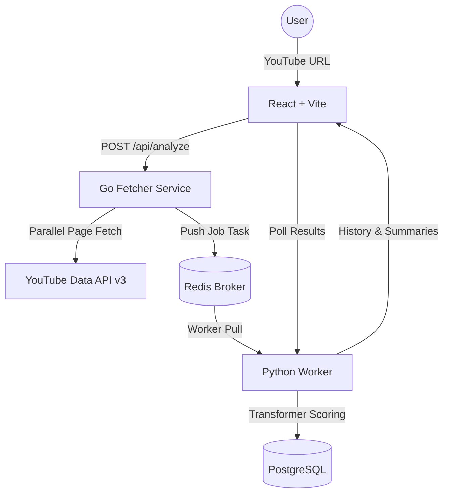
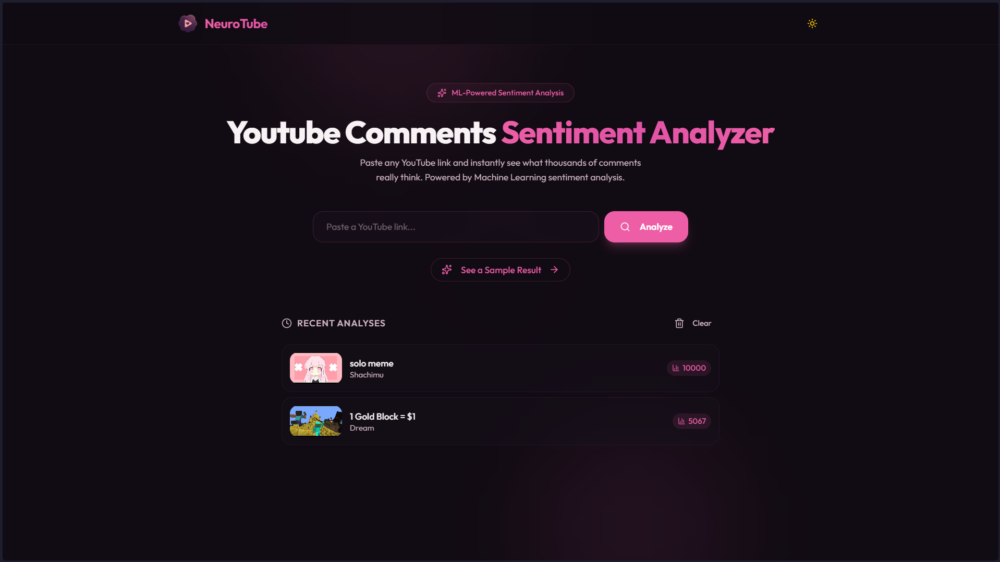
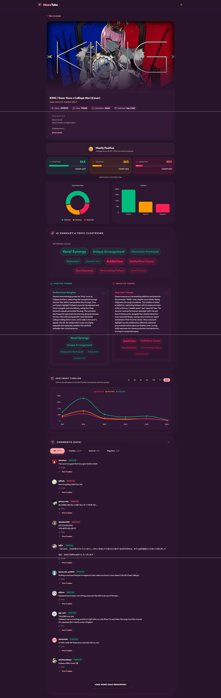

# NeuroTube: YouTube Comment Sentiment Analyzer

<div align="center">


**A full-stack application to analyze YouTube comment sentiments at scale.**

[](https://github.com/DaffMe/NeuroTube)
[](https://github.com/DaffMe/NeuroTube)

</div>

---

> [!NOTE]
> **Developer's Note:** This is my **first-ever project**! It was built entirely with the assistance of **Google Antigravity AI Agent**. Because this is my very first attempt at building a complex application, the code and architecture might not be 100% perfect. There might still be bugs or areas for optimization, but it's a huge learning milestone for me. Feedback and contributions are always welcome!

---

## 🌟 Overview

NeuroTube is a web application that takes a YouTube video URL and analyzes the sentiments of its comments. It fetches comments directly from YouTube, processes them using Natural Language Processing (NLP) to determine their sentiment (Positive, Neutral, Negative), and visualizes the results on an interactive dashboard.

The project uses a microservices architecture to separate the fast data ingestion from the heavier machine learning tasks.

---

## ✨ Features

- **Concurrent Data Fetching**: Uses a Go backend to rapidly fetch thousands of YouTube comments and their replies.
- **Sentiment Analysis Engine**: A Python FastAPI backend that runs a Dual-Engine Hugging Face Transformers setup (XLM-RoBERTa & Indo-RoBERTa) for highly accurate, multilingual sentiment classification.
- **Interactive Dashboard**: A modern, responsive frontend built with React 19 and Tailwind CSS v4, featuring:
  - **Sentiment Timeline**: A chart showing how sentiments change over time.
  - **Keyword Cloud**: A dynamic visual representation of the most common topics.
  - **Deep-Thread Comments Filtering**: Filter through thousands of comments based on their sentiment score.
- **Containerized**: Fully dockerized setup for easy local deployment.

---

## 🏗️ Architecture

The app is split into three main services:

1. **Frontend (React + Vite)**: Handles the user interface and data visualization.
2. **Fetcher Service (Go)**: Directly communicates with the YouTube Data API v3 to fetch comments as fast as possible and pushes them to Redis.
3. **ML Service (Python + FastAPI)**: Pulls comments from Redis, calculates sentiment scores using Transformer models, and stores the results in PostgreSQL.



---

## 🚀 Tech Stack

- **Frontend**: React 19, TypeScript, Tailwind CSS v4, Framer Motion, Recharts.
- **Backend Fetcher**: Go (Golang), Redis.
- **Backend ML**: Python 3.11, FastAPI, SQLModel, PostgreSQL, Hugging Face Transformers, PyTorch, Langdetect.
- **Infrastructure**: Docker & Docker Compose.

---

## 🖥️ UI Showcase

### Landing Page


### Dashboard


---

## 🚀 Quick Start (Docker)

To run this project locally, you need Docker installed and a YouTube API Key.

1. **Clone the repository**
   ```bash
   git clone https://github.com/DaffMe/NeuroTube.git
   cd NeuroTube
   ```

2. **Configure Environment Variables**
   ```bash
   cp .env.example .env
   ```
   Open the `.env` file and insert your `YOUTUBE_API_KEY`.

3. **Run with Docker Compose**
   ```bash
   docker compose up --build -d
   ```

4. **Access the Application**
   - **Frontend UI**: `http://localhost:5173`
   - **Python API Docs**: `http://localhost:8000/docs`

---

## 🛠️ Local Development (Without Docker)

If you prefer to run the services directly on your host machine:

### 🐍 ML Backend (Python)
```bash
cd backend-ml
python -m venv venv
source venv/bin/activate
pip install -r requirements.txt
uvicorn app.main:app --reload --port 8000
```

### 🐹 Fetcher Backend (Go)
```bash
cd backend-fetcher
go mod download
go run cmd/main.go
```

### 🎨 Frontend (React)
```bash
cd frontend
npm install
npm run dev
```

---

## 📝 Acknowledgments

- Built collaboratively with **Google Antigravity AI**.
- Inspired by [youtube-comment-sentiment-analyzer](https://github.com/00200200/youtube-comment-sentiment-analyzer).

---

<div align="center">
  <b>Developed by <a href="https://github.com/DaffMe">DaffMe</a></b>
</div>
