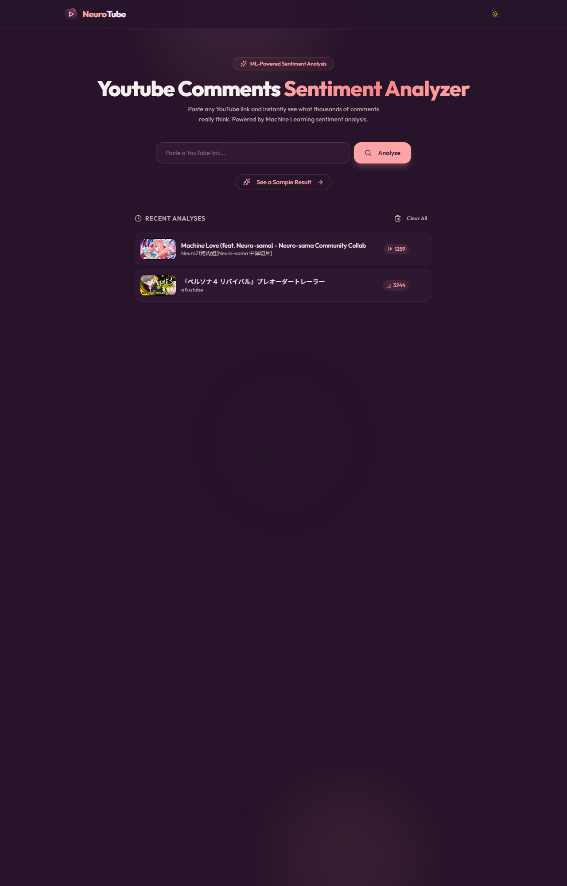
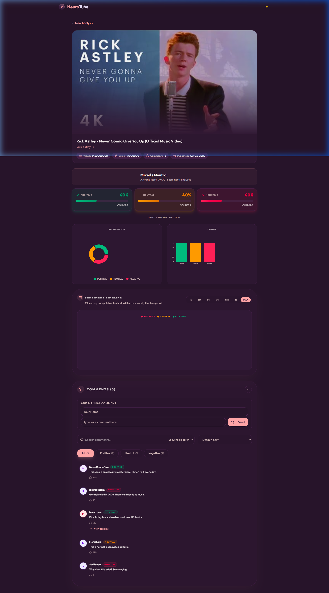

<!-- markdownlint-disable MD033 MD041 -->
<div align="center">

# NeuroTube: YouTube Comment Sentiment Analyzer


**A full-stack application to analyze YouTube comment sentiments at scale.**

[](https://react.dev)
[](https://go.dev)
[](https://python.org)

</div>

---

> [!NOTE]
> **Developer's Note:** This is my **first-ever project**! It was built entirely with the assistance of **Google Antigravity AI Agent**. Because this is my very first attempt at building a complex application, the code and architecture might not be 100% perfect. There might still be bugs or areas for optimization, but it's a huge learning milestone for me. Feedback and contributions are always welcome!

---

## Overview

NeuroTube is a web application that takes a YouTube video URL and analyzes the sentiments of its comments. It fetches comments directly from YouTube, processes them using Hugging Face Transformer models to determine their sentiment (Positive, Neutral, Negative), and visualizes the results on an interactive dashboard.

The project uses a microservices architecture to separate the fast data ingestion from the heavier machine learning tasks.

---

## Features

- **Tugas Besar Edition (Fully Documented)**: Seluruh basis kode aplikasi (Golang, Python, dan React) telah dilengkapi dengan anotasi komentar *line-by-line* dan penjelasan fungsi `import` dalam **Bahasa Indonesia** yang sangat komprehensif. Didesain khusus untuk mempermudah proses belajar dan presentasi akademik.
- **CRUD Komentar Manual (Requirement A)**: Pengguna dapat menambahkan komentar baru secara manual, mengedit komentar yang sudah ada, dan menghapus komentar melalui antarmuka web.
- **Analisis Sentimen Kata Kunci (Requirement B)**: Komentar manual dianalisis secara otomatis menggunakan metode pencocokan kata kunci positif dan negatif (`analyze_sentiment_keyword`).
- **Sequential & Binary Search (Requirement C)**: Pengguna dapat mencari komentar berdasarkan kata kunci menggunakan algoritma Sequential Search atau Binary Search yang dapat dipilih melalui dropdown di UI.
- **Selection & Insertion Sort (Requirement D)**: Pengguna dapat mengurutkan komentar berdasarkan panjang teks (Selection Sort) atau tingkat sentimen positif ke negatif (Insertion Sort).
- **Statistik Sentimen (Requirement E)**: Sistem menampilkan statistik jumlah komentar berdasarkan kategori sentimen (Positif, Netral, Negatif) melalui filter buttons dan grafik visualisasi.
- **Concurrent Data Fetching**: Uses a Go backend to rapidly fetch thousands of YouTube comments and their replies.
- **Dual-Engine Sentiment Analysis**: A Python FastAPI backend that runs Hugging Face Transformers (XLM-RoBERTa & Indo-RoBERTa) for highly accurate, multilingual sentiment classification. Dilengkapi juga dengan Regex Spammer Filter untuk menghemat resource GPU.
- **Interactive Dashboard**: A modern, responsive frontend built with React 19 and Tailwind CSS v4, featuring:
  - **Sentiment Timeline**: A chart showing how sentiments change over time.
  - **Keyword Cloud**: A dynamic visual representation of the most common topics (powered by Gemini AI).
  - **Deep-Thread Comments Filtering**: Filter through thousands of comments based on their sentiment score.
- **Containerized**: Fully dockerized setup for easy local deployment.

---

## Architecture

The app is split into three main services:

1. **Frontend (React + Vite)**: Handles the user interface, data visualization, search/sort algorithms, and CRUD komentar manual.
2. **Fetcher Service (Go)**: Directly communicates with the YouTube Data API v3 to fetch comments as fast as possible and pushes them to Redis.
3. **ML Service (Python + FastAPI)**: Pulls comments from Redis, calculates sentiment scores using Transformer models, stores results in PostgreSQL, and provides keyword-based sentiment analysis for manual comments.


```mermaid
graph TD
    User((User)) -->|YouTube URL| Frontend[React + Vite]
    Frontend -->|POST /api/analyze| Fetcher[Go Fetcher Service]
    Fetcher -->|Parallel Page Fetch| YT_API[YouTube Data API v3]
    Fetcher -->|Push Job Task| Redis[(Redis Broker)]
    Redis -->|Worker Pull| MLEngine[Python Worker]
    MLEngine -->|Transformer Scoring| DB[(PostgreSQL)]
    Frontend -->|Poll Results| MLEngine
    MLEngine -->|History & Summaries| Frontend
    Frontend -->|Manual Comment CRUD| MLEngine
    MLEngine -->|Keyword Sentiment| Frontend
```

---

## Tech Stack

- **Frontend**: React 19, TypeScript, Tailwind CSS v4, Shadcn UI, Framer Motion, Recharts.
- **Backend Fetcher**: Go 1.24, Redis.
- **Backend ML**: Python 3.13, FastAPI, SQLModel, PostgreSQL, Hugging Face Transformers, PyTorch, Langdetect, Gemini API (for AI summary).
- **Infrastructure**: Docker & Docker Compose.

---

## UI Showcase

### Landing Page



### Dashboard



---

## Quick Start (Docker)

To run this project locally, you need Docker installed and a YouTube API Key.

1. **Clone the repository**

   ```bash
   git clone https://github.com/DaffMe/NeuroTube.git
   cd NeuroTube
   ```

2. **Configure Environment Variables**

   ```bash
   cp .env.example .env
   ```

   Open the `.env` file and insert your `YOUTUBE_API_KEY` and optionally `GEMINI_API_KEY`.

3. **Run with Docker Compose**

   ```bash
   docker compose up --build -d
   ```

4. **Access the Application**
   - **Frontend UI**: `http://localhost:5173`
   - **Python API Docs**: `http://localhost:8000/docs`

> [!TIP]
> Untuk **mematikan Docker sementara** tanpa menghapus data: `docker compose stop`
> Untuk **menyalakan ulang**: `docker compose start`
> Untuk **menghapus semua** (termasuk data database): `docker compose down -v`

---

## Local Development (Without Docker)

If you prefer to run the services directly on your host machine, you still need PostgreSQL and Redis running (can use Docker for just these two):

```bash
docker compose start postgres redis
```

### ML Backend (Python)

```bash
cd backend-ml
python -m venv venv
# Windows:
.\venv\Scripts\activate
# Linux/Mac:
# source venv/bin/activate
pip install -r requirements.txt
uvicorn app.main:app --reload --host 0.0.0.0 --port 8000
```

### Fetcher Backend (Go)

```bash
cd backend-fetcher
go mod download
go run ./cmd/server
```

### Frontend (React)

```bash
cd frontend
npm install
npm run dev
```

---

## Tugas Besar Specifications Checklist

| # | Requirement | Status | Implementation |
| --- | ------------ | -------- | ---------------- |
| a | CRUD Komentar (Tambah, Ubah, Hapus) | ✅ | `analysis.py` (POST/PUT/DELETE endpoints), `CommentSection.tsx` (UI form) |
| b | Analisis Sentimen Kata Kunci | ✅ | `analysis.py` → `analyze_sentiment_keyword()` |
| c | Sequential & Binary Search | ✅ | `algorithms.ts` → `sequentialSearch()`, `binarySearch()` |
| d | Selection & Insertion Sort | ✅ | `algorithms.ts` → `selectionSortByLength()`, `insertionSortBySentiment()` |
| e | Statistik Sentimen | ✅ | `CommentSection.tsx` (filter counts), `StatBlock.tsx`, `CommentCharts.tsx` |

---

## Acknowledgments

- Built collaboratively with **Google Antigravity AI Agent**.
- Inspired by [youtube-comment-sentiment-analyzer](https://github.com/00200200/youtube-comment-sentiment-analyzer).

---

<div align="center">
  <b>Developed by <a href="https://github.com/DaffMe">DaffMe</a></b>
</div>
