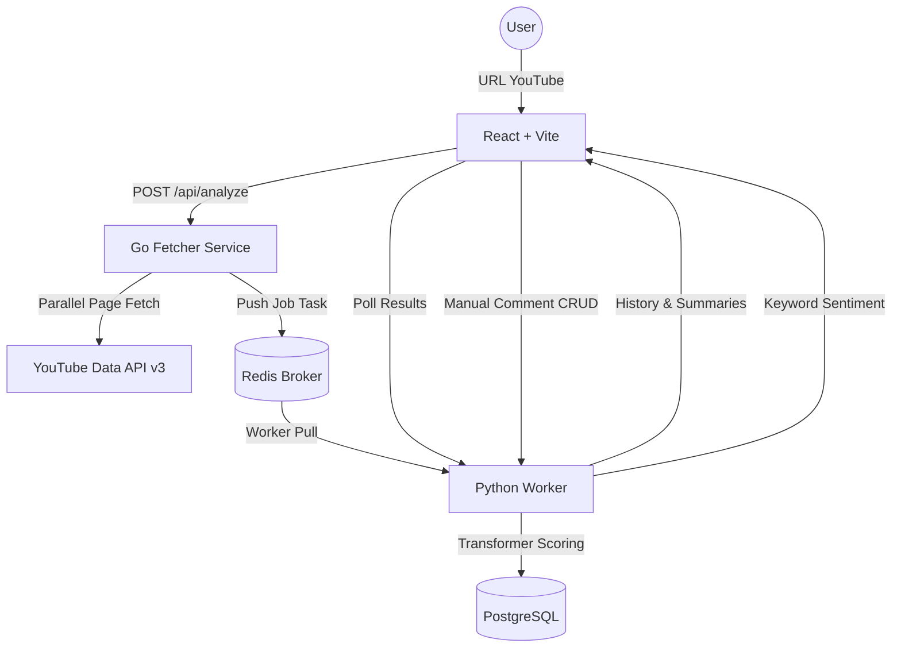

<!-- markdownlint-disable MD033 MD041 -->
<div align="center">

# NeuroTube: Analisis Sentimen Komentar YouTube


**Aplikasi full-stack buat nganalisis sentimen ribuan komentar YouTube secara otomatis.**

[](https://react.dev)
[](https://go.dev)
[](https://python.org)

</div>

---

> [!NOTE]
> **Catatan Developer:** Ini adalah **project pertamaku**! Aku bikin ini full dengan bantuan **Google Antigravity AI Agent**. Karena ini pengalaman pertamaku bikin aplikasi yang lumayan kompleks, kode dan arsitekturnya mungkin belum 100% sempurna. Pasti masih ada bug atau bagian yang bisa dioptimasi lagi, tapi ini udah jadi batu loncatan belajar yang luar biasa buatku. Kritik dan saran selalu terbuka ya!

---

## Gambaran Umum

NeuroTube itu aplikasi web yang kerjanya ngambil URL video YouTube, terus dia bakal nganalisis sentimen dari komentar-komentarnya. Dia narik komentar langsung dari YouTube, memprosesnya pakai model Hugging Face Transformers buat nentuin apakah sentimennya (Positif, Netral, atau Negatif), dan nampilin hasilnya di dashboard interaktif yang keren.

Project ini pakai arsitektur *microservices* biar proses narik data yang cepat bisa dipisah dari proses *machine learning* yang lumayan berat.

---

## Fitur Utama

- **Edisi Tugas Besar (Full Dokumentasi)**: Seluruh baris kode aplikasi (Golang, Python, dan React) udah aku kasih anotasi komentar *line-by-line* dan penjelasan fungsi `import` dalam **Bahasa Indonesia** yang gampang dipahami. Didesain khusus biar gampang buat dipelajari dan dipresentasiin buat tugas kampus.
- **CRUD Komentar Manual (Ketentuan A)**: Kita bisa nambahin komentar baru secara manual, ngedit komentar yang udah ada, atau ngehapus komentar langsung dari tampilan webnya.
- **Analisis Sentimen Kata Kunci (Ketentuan B)**: Komen yang diinput manual bakal dianalisis otomatis pakai metode pencocokan kata kunci positif dan negatif (`analyze_sentiment_keyword`).
- **Sequential & Binary Search (Ketentuan C)**: Kalau mau nyari komentar berdasarkan kata kunci, bisa milih mau pakai algoritma Sequential Search atau Binary Search lewat dropdown di UI.
- **Selection & Insertion Sort (Ketentuan D)**: Mau ngurutin komentar? Bisa diurutin berdasarkan panjang teks (pakai Selection Sort) atau tingkat sentimen dari positif ke negatif (pakai Insertion Sort).
- **Statistik Sentimen (Ketentuan E)**: Sistem bakal nampilin statistik jumlah komentar per kategori sentimen (Positif, Netral, Negatif) lewat filter button dan visualisasi grafik.
- **Tarik Data Cepat (Concurrent)**: Pakai backend Go buat narik ribuan komentar dan balasannya dari YouTube secara paralel.
- **Dual-Engine Sentiment Analysis**: Backend Python FastAPI yang ngejalanin model Hugging Face Transformers (XLM-RoBERTa & Indo-RoBERTa) buat klasifikasi sentimen multi-bahasa yang akurat. Plus, ada Regex Spammer Filter buat ngehemat beban GPU.
- **Dashboard Interaktif**: Frontend yang modern dan responsif dibangun pakai React 19 dan Tailwind CSS v4. Fiturnya:
  - **Sentiment Timeline**: Grafik garis waktu tren sentimen.
  - **Keyword Cloud**: Awan kata kunci yang dinamis buat nunjukin topik yang paling sering dibahas (didukung Gemini AI).
  - **Filter Komentar Deep-Thread**: Bisa filter ribuan komentar berdasarkan skor sentimennya.
- **Containerized**: Udah full pakai Docker jadi gampang banget buat dijalanin di lokal.

---

## Arsitektur Sistem

Aplikasi ini dibagi jadi 3 service utama:

1. **Frontend (React + Vite)**: Ngurusin antarmuka pengguna, visualisasi data, algoritma search/sort, dan CRUD komentar manual.
2. **Fetcher Service (Go)**: Berkomunikasi langsung dengan YouTube Data API v3 buat narik komentar secepat kilat dan ngirim datanya ke antrean Redis.
3. **ML Service (Python + FastAPI)**: Ngambil antrean komentar dari Redis, ngitung skor sentimen pakai model Transformer, nyimpen hasilnya ke PostgreSQL, dan ngurusin analisis sentimen kata kunci buat komentar manual.


```mermaid
graph TD
    User((User)) -->|URL YouTube| Frontend[React + Vite]
    Frontend -->|POST /api/analyze| Fetcher[Go Fetcher Service]
    Fetcher -->|Parallel Page Fetch| YT_API[YouTube Data API v3]
    Fetcher -->|Push Job Task| Redis[(Redis Broker)]
    Redis -->|Worker Pull| MLEngine[Python Worker]
    MLEngine -->|Transformer Scoring| DB[(PostgreSQL)]
    Frontend -->|Poll Results| MLEngine
    MLEngine -->|History & Summaries| Frontend
    Frontend -->|Manual Comment CRUD| MLEngine
    MLEngine -->|Keyword Sentiment| Frontend
```

---

## Tech Stack (Teknologi yang Dipakai)

- **Frontend**: React 19, TypeScript, Tailwind CSS v4, Shadcn UI, Framer Motion, Recharts.
- **Backend Fetcher**: Go 1.24, Redis.
- **Backend ML**: Python 3.13, FastAPI, SQLModel, PostgreSQL, Hugging Face Transformers, PyTorch, Langdetect, Gemini API (buat ringkasan AI).
- **Infrastruktur**: Docker & Docker Compose.

---

## Tampilan UI (Showcase)

### Halaman Utama


### Dashboard Analisis


---

## Cara Jalanin Pakai Docker (Quick Start)

Buat jalanin project ini di komputer kamu, pastikan udah install Docker dan punya YouTube API Key.

1. **Clone repository-nya**

   ```bash
   git clone https://github.com/DaffMe/NeuroTube.git
   cd NeuroTube
   ```

2. **Atur Environment Variables**

   ```bash
   cp .env.example .env
   ```

   Buka file `.env` dan masukin `YOUTUBE_API_KEY` kamu (kalau ada `GEMINI_API_KEY` boleh dimasukin juga).

3. **Jalankan Docker Compose**

   ```bash
   docker compose up --build -d
   ```

4. **Buka Aplikasinya**
   - **Frontend UI**: `http://localhost:5173`
   - **Python API Docs**: `http://localhost:8000/docs`

> [!TIP]
> Buat **matiin Docker sementara** (data aman gak ilang): `docker compose stop`
> Buat **nyalain lagi**: `docker compose start`
> Buat **menghapus semua** (termasuk data di database): `docker compose down -v`

---

## Cara Jalanin Lokal (Tanpa Docker)

Kalau kamu lebih suka ngejalanin service-nya langsung di komputer (lokal), kamu tetap butuh PostgreSQL dan Redis nyala (bisa pakai Docker khusus buat 2 ini aja):

```bash
docker compose start postgres redis
```

### ML Backend (Python)

```bash
cd backend-ml
python -m venv venv
# Buat Windows:
.\venv\Scripts\activate
# Buat Linux/Mac:
# source venv/bin/activate
pip install -r requirements.txt
uvicorn app.main:app --reload --host 0.0.0.0 --port 8000
```

### Fetcher Backend (Go)

```bash
cd backend-fetcher
go mod download
go run ./cmd/server
```

### Frontend (React)

```bash
cd frontend
npm install
npm run dev
```

---

## Checklist Ketentuan Tugas Besar

| # | Ketentuan | Status | Lokasi Kode |
| --- | ------------ | -------- | ---------------- |
| a | CRUD Komentar (Tambah, Ubah, Hapus) | ✅ | `analysis.py` (POST/PUT/DELETE endpoints), `CommentSection.tsx` (UI form) |
| b | Analisis Sentimen Kata Kunci | ✅ | `analysis.py` → fungsi `analyze_sentiment_keyword()` |
| c | Sequential & Binary Search | ✅ | `algorithms.ts` → fungsi `sequentialSearch()`, `binarySearch()` |
| d | Selection & Insertion Sort | ✅ | `algorithms.ts` → fungsi `selectionSortByLength()`, `insertionSortBySentiment()` |
| e | Statistik Sentimen | ✅ | `CommentSection.tsx` (hitungan filter), `StatBlock.tsx`, `CommentCharts.tsx` |

---

## Apresiasi

- Dibangun secara kolaboratif bareng **Google Antigravity AI Agent**.
- Terinspirasi dari [youtube-comment-sentiment-analyzer](https://github.com/00200200/youtube-comment-sentiment-analyzer).

---

<div align="center">
  <b>Developed by <a href="https://github.com/DaffMe">DaffMe</a></b>
</div>
