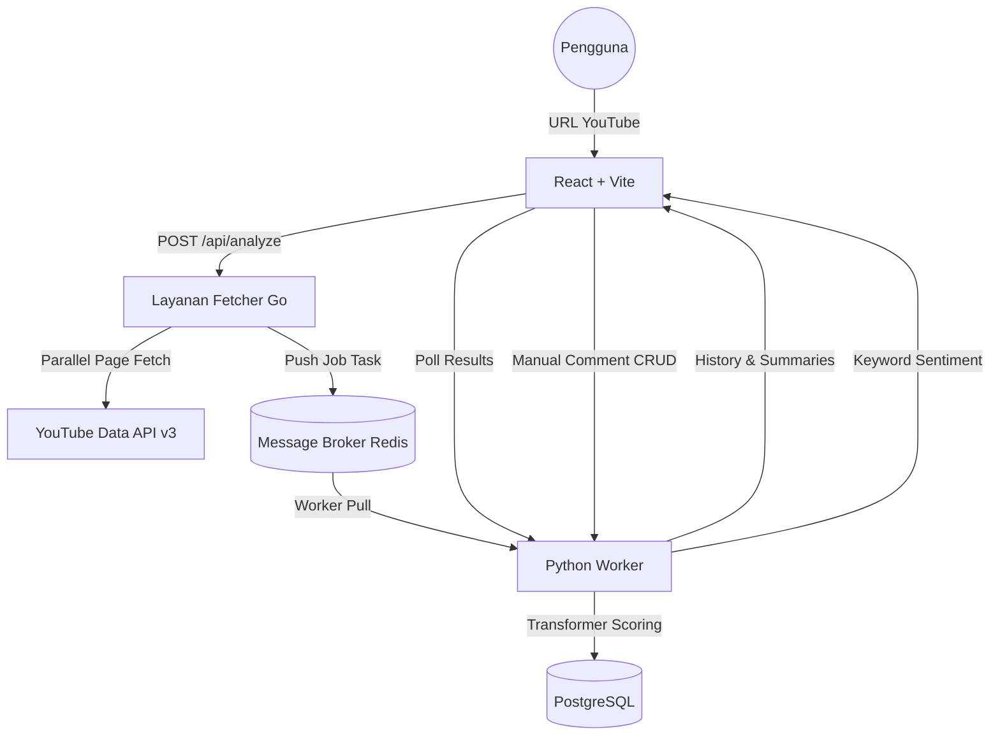

<!-- markdownlint-disable MD033 MD041 -->
<div align="center">

# NeuroTube: Analisis Sentimen Komentar YouTube


**Aplikasi full-stack untuk menganalisis sentimen ribuan komentar YouTube secara otomatis pada skala besar.**

[](https://react.dev)
[](https://go.dev)
[](https://python.org)

</div>

---

> [!NOTE]
> **Catatan Pengembang:** Proyek ini merupakan **proyek pengembangan aplikasi pertama** saya, yang dibangun dengan bantuan kolaboratif dari **Google Antigravity AI Agent**. Sebagai langkah awal dalam membangun sistem arsitektur perangkat lunak yang kompleks, mungkin masih terdapat ruang untuk optimasi maupun perbaikan _bug_. Masukan, kritik membangun, serta kontribusi dari rekan-rekan sangat diapresiasi.

---

## Gambaran Umum

NeuroTube adalah aplikasi web yang dirancang untuk menerima tautan video YouTube dan menganalisis sentimen dari komentar-komentar pada video tersebut. Sistem akan mengekstraksi data komentar langsung dari YouTube Data API, memprosesnya menggunakan model bahasa Hugging Face Transformers untuk mengklasifikasikan polaritas sentimen (Positif, Netral, atau Negatif), dan menyajikan visualisasi data yang komprehensif pada dasbor interaktif.

Proyek ini mengadopsi arsitektur _microservices_ untuk memisahkan proses ekstraksi data konkuren yang berkinerja tinggi dari komputasi _machine learning_ yang membutuhkan sumber daya besar.

---

## Fitur Utama

- **Edisi Tugas Besar (Terdokumentasi Penuh)**: Seluruh basis kode aplikasi (Golang, Python, dan React) telah dilengkapi dengan anotasi komentar pada setiap baris serta penjelasan pustaka (`import`) dalam **Bahasa Indonesia** yang komprehensif. Struktur ini didesain khusus untuk memfasilitasi kebutuhan akademis dan mempermudah proses pembelajaran.
- **CRUD Komentar Manual (Ketentuan A)**: Pengguna memiliki akses manajemen data untuk menambahkan, mengubah, serta menghapus komentar secara manual melalui antarmuka web.
- **Analisis Sentimen Kata Kunci (Ketentuan B)**: Setiap komentar yang ditambahkan secara manual akan dianalisis secara otomatis menggunakan metode pencocokan kata kunci sentimen positif dan negatif (`analyze_sentiment_keyword`).
- **Sequential & Binary Search (Ketentuan C)**: Modul pencarian komentar dilengkapi dengan dua metode algoritma, yakni _Sequential Search_ dan _Binary Search_, yang dapat dikonfigurasi langsung dari antarmuka pengguna.
- **Selection & Insertion Sort (Ketentuan D)**: Kemampuan pengurutan data (_sorting_) mencakup _Selection Sort_ untuk mengurutkan berdasarkan panjang karakter teks, dan _Insertion Sort_ untuk mengurutkan berdasarkan tingkat polaritas sentimen.
- **Statistik Sentimen (Ketentuan E)**: Sistem secara otomatis menghasilkan agregasi data yang menampilkan metrik total komentar per kategori sentimen (Positif, Netral, Negatif) yang divisualisasikan melalui tombol filter dan grafik.
- **Ekstraksi Data Konkuren**: Mengimplementasikan layanan _backend_ menggunakan bahasa Go untuk mengekstraksi puluhan ribu komentar dan balasan dari YouTube secara paralel dalam hitungan detik.
- **Dual-Engine Sentiment Analysis**: Layanan ML _backend_ berbasis Python FastAPI yang menjalankan model Hugging Face Transformers (XLM-RoBERTa & Indo-RoBERTa) guna menghasilkan klasifikasi sentimen multi-bahasa dengan tingkat akurasi tinggi. Diperkuat dengan fitur penyaringan _spam_ berbasis Regex untuk efisiensi komputasi GPU.
- **Dasbor Interaktif Modern**: Antarmuka _frontend_ yang responsif, dikembangkan dengan ekosistem modern React 19 dan Tailwind CSS v4. Meliputi:
  - **Sentiment Timeline**: Representasi grafis perubahan tren sentimen berdasarkan rentang waktu.
  - **Keyword Cloud**: Visualisasi awan kata kunci secara dinamis yang menyoroti topik paling dominan (didukung oleh Gemini AI).
  - **Filter Komentar Deep-Thread**: Penyaringan komentar spesifik berdasarkan pembobotan skor sentimen.
- **Siap Deployment (Containerized)**: Lingkungan pengembangan telah diisolasi sepenuhnya menggunakan Docker, memastikan proses instalasi yang konsisten di berbagai perangkat.

---

## Arsitektur Sistem

Ekosistem aplikasi ini terbagi menjadi 3 layanan utama:

1. **Layanan Frontend (React + Vite)**: Menangani antarmuka pengguna, visualisasi data, eksekusi algoritma pencarian/pengurutan di sisi klien, serta antarmuka CRUD untuk komentar manual.
2. **Layanan Fetcher (Go)**: Berfungsi sebagai agen ekstraksi data yang berinteraksi langsung dengan YouTube Data API v3 untuk mengumpulkan komentar secara asinkron dan mendistribusikannya ke antrean Redis.
3. **Layanan Machine Learning (Python + FastAPI)**: Berfungsi sebagai pekerja latar belakang (_background worker_) yang mengambil tugas dari Redis, mengalkulasi skor sentimen melalui inferensi model Transformer, menyimpan hasil akhir ke dalam PostgreSQL, serta menangani API untuk analisis sentimen kata kunci.


```mermaid
graph TD
    User((Pengguna)) -->|URL YouTube| Frontend[React + Vite]
    Frontend -->|POST /api/analyze| Fetcher[Layanan Fetcher Go]
    Fetcher -->|Parallel Page Fetch| YT_API[YouTube Data API v3]
    Fetcher -->|Push Job Task| Redis[(Message Broker Redis)]
    Redis -->|Worker Pull| MLEngine[Python Worker]
    MLEngine -->|Transformer Scoring| DB[(PostgreSQL)]
    Frontend -->|Poll Results| MLEngine
    MLEngine -->|History & Summaries| Frontend
    Frontend -->|Manual Comment CRUD| MLEngine
    MLEngine -->|Keyword Sentiment| Frontend
```

---

## Teknologi yang Digunakan (Tech Stack)

- **Frontend**: React 19, TypeScript, Tailwind CSS v4, Shadcn UI, Framer Motion, Recharts.
- **Backend Fetcher**: Go 1.24, Redis.
- **Backend ML**: Python 3.13, FastAPI, SQLModel, PostgreSQL, Hugging Face Transformers, PyTorch, Langdetect, Gemini API (untuk ekstraksi ringkasan topik).
- **Infrastruktur & DevOps**: Docker & Docker Compose.

---

## Cuplikan Antarmuka (UI Showcase)

### Halaman Beranda


### Dasbor Analitik


---

## Panduan Instalasi Cepat (Dengan Docker)

Untuk menjalankan proyek ini di lingkungan pengembangan lokal, pastikan Docker telah terpasang dan Anda memiliki Kunci API YouTube (_YouTube API Key_).

1. **Kloning Repositori**

   ```bash
   git clone https://github.com/DaffMe/NeuroTube.git
   cd NeuroTube
   ```

2. **Konfigurasi Variabel Lingkungan (_Environment Variables_)**

   ```bash
   cp .env.example .env
   ```

   Buka file `.env` menggunakan teks editor Anda dan masukkan kredensial `YOUTUBE_API_KEY`. (Opsional: tambahkan `GEMINI_API_KEY` untuk mengaktifkan fitur ringkasan topik AI).

3. **Jalankan Layanan dengan Docker Compose**

   ```bash
   docker compose up --build -d
   ```

4. **Akses Aplikasi**
   - **Antarmuka Frontend**: `http://localhost:5173`
   - **Dokumentasi API Python**: `http://localhost:8000/docs`

> [!TIP]
>
> - Untuk **menghentikan Docker sementara** (data tetap aman): `docker compose stop`
> - Untuk **menjalankan kembali layanan**: `docker compose start`
> - Untuk **menghentikan dan menghapus semua data container** (termasuk isi database): `docker compose down -v`

---

## Pengembangan Lokal (Tanpa Docker)

Apabila Anda lebih memilih untuk mengeksekusi layanan secara langsung di mesin lokal (_host_), Anda tetap diwajibkan untuk menjalankan instansi PostgreSQL dan Redis (dapat dijalankan secara terpisah menggunakan Docker):

```bash
docker compose start postgres redis
```

### Backend ML (Python)

```bash
cd backend-ml
python -m venv venv

# Untuk sistem operasi Windows:
.\venv\Scripts\activate
# Untuk sistem operasi Linux/macOS:
# source venv/bin/activate

pip install -r requirements.txt
uvicorn app.main:app --reload --host 0.0.0.0 --port 8000
```

### Backend Fetcher (Go)

```bash
cd backend-fetcher
go mod download
go run ./cmd/server
```

### Frontend (React)

```bash
cd frontend
npm install
npm run dev
```

---

## Checklist Pemenuhan Persyaratan Tugas Besar

| # | Persyaratan | Status | Lokasi Implementasi |
| --- | ------------ | -------- | ---------------- |
| a | Operasi CRUD Komentar (Tambah, Ubah, Hapus) | ✅ | `analysis.py` (API endpoints HTTP POST/PUT/DELETE), `CommentSection.tsx` (Formulir antarmuka) |
| b | Analisis Sentimen Berbasis Kata Kunci | ✅ | `analysis.py` → metode `analyze_sentiment_keyword()` |
| c | Algoritma Pencarian (_Sequential & Binary Search_) | ✅ | `algorithms.ts` → utilitas `sequentialSearch()`, `binarySearch()` |
| d | Algoritma Pengurutan (_Selection & Insertion Sort_) | ✅ | `algorithms.ts` → utilitas `selectionSortByLength()`, `insertionSortBySentiment()` |
| e | Rekapitulasi Statistik Sentimen | ✅ | `CommentSection.tsx` (tombol penyaring dinamis), `StatBlock.tsx`, `CommentCharts.tsx` |

---

## Penghargaan

- Proyek ini dikembangkan secara kolaboratif bersama dengan integrasi AI dari **Google Antigravity Agent**.
- Terinspirasi oleh konsep arsitektur dari [youtube-comment-sentiment-analyzer](https://github.com/00200200/youtube-comment-sentiment-analyzer).

---

<div align="center">
  <b>Dikembangkan oleh <a href="https://github.com/DaffMe">DaffMe</a></b>
</div>
