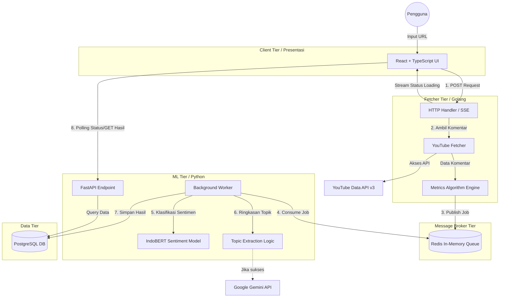

# Dokumen Perancangan Sistem (System Design) NeuroTube

## 1. Tinjauan Umum (System Overview)

NeuroTube adalah aplikasi analitik sentimen komentar YouTube berbasis Kecerdasan Buatan (AI) yang dibangun menggunakan arsitektur **Microservices**. Tujuan utama sistem ini adalah untuk mengambil ribuan komentar dari suatu video YouTube dalam hitungan detik, mengklasifikasikan sentimen secara statistik menggunakan *Machine Learning*, serta mengekstrak opini dominan pengguna menggunakan *Generative AI*.

## 2. Diagram Arsitektur Sistem

## 3. Komponen Sistem (System Components)

Arsitektur NeuroTube dibagi menjadi 5 lapisan utama (*Tiers*):

1. **Client Tier (Frontend - React/TypeScript/Vite)**
   Bertugas sebagai lapisan interaksi pengguna. Menampilkan antarmuka yang sangat responsif (*Single Page Application*) dan merender representasi grafis (seperti *Pie Chart* dan *Keyword Cloud*) berdasarkan agregasi data (*Data Aggregation*) dari layanan Backend.

2. **Fetcher Tier (Backend - Golang)**
   Berfungsi sebagai gerbang masuk pertama (layaknya *API Gateway* sementara). Golang dipilih pada lapisan ini secara spesifik karena kemampuannya dalam mengeksekusi banyak proses secara bersamaan (*Concurrency* via *Goroutine*) yang membuat penarikan ribuan komentar dari YouTube menjadi sangat cepat tanpa menghabiskan memori. Di lapisan ini juga diterapkan struktur logika algoritma matematis statis (sesuai materi perkuliahan).

3. **Message Broker Tier (Redis)**
   Berfungsi sebagai penengah (*Middleman*) sekaligus penyeimbang beban kerja (*Load Balancer*). Karena penarikan data YouTube (Go) sangat cepat sedangkan analisis AI (Python) cenderung lambat, Redis bertindak sebagai "ruang tunggu sementara" agar server Python tidak kelebihan beban (*Overload* / *Memory Crash*). Ini dikenal dengan konsep **Asynchronous Task Queue**.

4. **Machine Learning Tier (Backend - Python/FastAPI)**
   Lapisan komputasi AI. Python dipilih karena ekosistem pemrosesan bahasa alaminya (*NLP*) yang matang. Pekerja di latar belakang (*Worker*) menarik data dari Redis, menggunakan model bahasa (LLM & BERT) untuk menghitung sentimen setiap kalimat, meringkas topik, dan mengompilasi kesimpulan akhir.

5. **Data Tier (PostgreSQL)**
   Sistem Manajemen Basis Data Relasional (*RDBMS*). Bertugas untuk merekam secara permanen hasil analisis kecerdasan buatan, sehingga laporan historis dapat ditampilkan berulang kali tanpa perlu mengirim kueri analisis ulang.

## 4. Alur Proses Aplikasi (Data Flow)

Berikut adalah siklus hidup satu buah proses analisis (*End-to-End Pipeline*):

1. **Inisiasi Klien:** Pengguna menempelkan tautan video YouTube di *Frontend* dan menekan tombol analisis.
2. **Penarikan Data (*Data Ingestion*):** Klien menembak API Golang. Golang terhubung ke server Google (YouTube API) dan memanen komentar.
3. **Pengantrean (*Message Queuing*):** Golang mengekstrak parameter dasar, lalu melempar JSON paket ribuan komentar ke dalam antrean Redis. Pada saat yang sama, Golang merespons ke Klien untuk membuka koneksi *Server-Sent Events* (SSE) guna memantau persentase kemajuan analisis.
4. **Analisis Otonom (*Background Processing*):** File `worker.py` di dalam Python mendeteksi keberadaan paket di Redis. Ia mengambil paket tersebut, mengiris teks komentar menjadi bagian kecil (*batching*), dan memproses setiap kalimat dengan algoritma AI secara asinkron.
5. **Persistensi Data (*Persistence*):** Setelah algoritma NLP dan Gemini API selesai meracik hasil, Python memvalidasi skema data dan menyimpannya (operasi *INSERT*) ke dalam PostgreSQL.
6. **Penarikan Hasil (*Data Fetching*):** *Frontend*, yang menyadari bahwa proses telah rampung, mengirimkan *GET Request* ke API Python (`endpoints.py`). Data dikirimkan kembali ke *Frontend* untuk dirender pada *Dashboard*.

## 5. Pertimbangan Desain (Design Decisions)

Mengapa NeuroTube dirancang sekompleks ini (Microservices) dibandingkan dijadikan satu program tunggal (Monolith)?

- **Decoupling (Pemisahan Tugas):** Jika layanan AI (Python) sedang rusak atau kelebihan beban, proses pengambilan komentar (Golang) dan koneksi *Frontend* tidak akan ikut *Crash*.
- **Scalability (Skalabilitas):** Jika jumlah pengguna bertambah, kita bisa menduplikasi kontainer Python (AI) menjadi 5 atau 10 peladen secara spesifik tanpa harus menduplikasi layanan Golang.
- **Polyglot Architecture:** Memungkinkan pemanfaatan fitur terbaik dari berbagai bahasa pemrograman. Go digunakan di titik yang membutuhkan kecepatan proses dan *multithreading* (HTTP & API *Fetching*), sedangkan Python digunakan di titik komputasi berat (*Machine Learning*).
